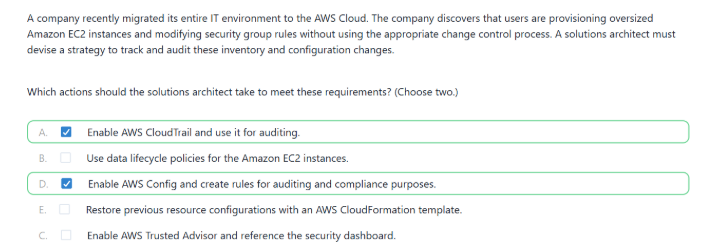
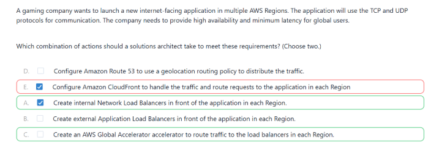

# AWS Advanced Networking and Compute Services

---

# 1. AWS CloudFront

## What is CloudFront?

AWS CloudFront is a CDN service.

CDN means:
Content Delivery Network.

It helps websites and applications load faster for users around the world.

CloudFront stores copies of content in different AWS Edge Locations.

---

## Main Purpose of CloudFront

CloudFront is mainly used for:
- Faster websites
- Faster image loading
- Faster video streaming
- Faster API responses

---

## Important Components

### 1. Edge Location

Edge Location is a place where CloudFront stores cached data.

It is located in many countries around the world.

Nearby edge location = faster response.

---

### 2. Origin

Origin means:
The original source of the content.

Examples:
- Amazon S3
- EC2 Instance
- Load Balancer
- Web Server

---

### 3. Cache

Cache means temporary storage.

CloudFront stores copies of files in cache.

Examples:
- Images
- CSS
- JavaScript
- Videos

---

## How CloudFront Works

Step 1:
User requests website.

Step 2:
CloudFront checks nearest edge location.

Step 3:
If data exists in cache:
- Send data immediately

Step 4:
If data does not exist:
- Fetch from origin server
- Store in cache
- Send to user

---

## Advantages

- Faster performance
- Low latency
- Reduced server load
- Better user experience
- Global delivery
- DDoS protection

---

## Common Use Cases

- Netflix-like streaming
- Website acceleration
- Gaming content
- Image delivery
- API acceleration

---

# 2. AWS Transit Gateway

## What is Transit Gateway?

Transit Gateway is a central networking hub in AWS.

It connects:
- Multiple VPCs
- VPN connections
- On-premise networks

---

## Why Transit Gateway is Needed

Suppose you have:
- 5 VPCs

Without Transit Gateway:
- Every VPC needs peering connections
- Too many connections are created

Network becomes:
- Complex
- Difficult to manage

---

## Simple Concept

Without Transit Gateway:

VPC1 ↔ VPC2  
VPC1 ↔ VPC3  
VPC2 ↔ VPC4  

Too many connections.

---

With Transit Gateway:

                Transit Gateway
               /      |      \
            VPC1    VPC2    VPC3

Only one central hub manages communication.

---

## Main Purpose

Transit Gateway simplifies AWS networking.

Instead of:
- Many peerings

We use:
- One central gateway

---

## Advantages

- Easy network management
- Centralized routing
- Better scalability
- Cleaner architecture
- Supports hybrid cloud

---

## Real-Life Example

Suppose a company has:
- HR VPC
- Finance VPC
- DevOps VPC
- Production VPC

All VPCs connect through:
- Transit Gateway

This makes communication easier.

---

## Common Use Cases

- Enterprise networking
- Multi-account AWS setup
- Hybrid cloud architecture
- Branch office connectivity

---

# 3. AWS NAT Gateway

## What is NAT Gateway?

NAT Gateway allows private subnet resources to access the internet securely.

But internet cannot directly access them.

---

## Important Point

NAT Gateway allows:
- Outbound internet traffic

It does NOT allow:
- Incoming internet traffic

So it increases security.

---

## How NAT Gateway Works

Private EC2  
↓  
NAT Gateway  
↓  
Internet Gateway  
↓  
Internet

---

## Where NAT Gateway is Created

NAT Gateway is always created inside:
- Public Subnet

Private subnet routes traffic through NAT Gateway.

---

## Why Private Subnet Uses NAT Gateway

Private subnet is more secure because:
- No direct public access

But servers still need internet sometimes.

NAT Gateway solves this securely.

---

## Advantages

- Secure internet access
- Managed AWS service
- High availability
- Easy setup
- No manual maintenance

---

## Real-Life Example

Suppose:
Backend database server is inside private subnet.

It needs:
- Security updates from internet

NAT Gateway helps it download updates securely.

---

## Common Use Cases

- Private EC2 internet access
- Secure backend servers
- Downloading software updates

---

# 4. AWS Spot Fleet

## What is Spot Fleet?

Spot Fleet is a group of Spot Instances managed automatically by AWS.

AWS launches instances based on:
- Lowest price
- Available capacity
- Instance availability

---

## First Understand Spot Instances

Spot Instances are:
Unused EC2 capacity sold at lower prices.

Advantages:
- Very cheap
- Huge cost savings

Disadvantage:
- AWS can terminate them anytime

---

## Main Purpose of Spot Fleet

Spot Fleet automatically:
- Launches Spot Instances
- Maintains required capacity
- Replaces interrupted instances

---

## Simple Explanation

Suppose:
You need 20 servers for data processing.

Instead of manually:
- Launching EC2
- Monitoring prices
- Managing interruptions

Spot Fleet does everything automatically.

---

## How Spot Fleet Works

Step 1:
User defines required capacity.

Step 2:
AWS checks cheapest Spot Instances.

Step 3:
AWS launches instances automatically.

Step 4:
If one instance stops:
- AWS launches another one

---

## Important Features

### 1. Target Capacity

How many resources are needed.

Example:
- 10 instances
- 50 vCPUs

---

### 2. Allocation Strategy

How AWS chooses instances.

Examples:
- Lowest price
- Capacity optimized

---

## Advantages

- Very low cost
- Automatic management
- Flexible scaling
- Better resource optimization

---

## Real-Life Example

A company runs:
- Machine Learning training jobs

Instead of expensive On-Demand EC2:
- They use Spot Fleet
- Save large amount of money

---

## Common Use Cases

- Machine Learning
- Batch processing
- Big data workloads
- CI/CD pipelines
- Rendering systems

---

# Quick Revision Table

| Service | Purpose |
|---|---|
| CloudFront | Faster content delivery |
| Transit Gateway | Connect multiple VPCs |
| NAT Gateway | Internet access for private subnet |
| Spot Fleet | Low-cost EC2 management |

---

# Final Summary

CloudFront:
Used to deliver content faster globally.

Transit Gateway:
Used to simplify networking between multiple VPCs.

NAT Gateway:
Used to provide secure internet access for private subnet resources.

Spot Fleet:
Used to reduce EC2 costs using Spot Instances.

Today ,I also practice the MCQ in examprepper:

