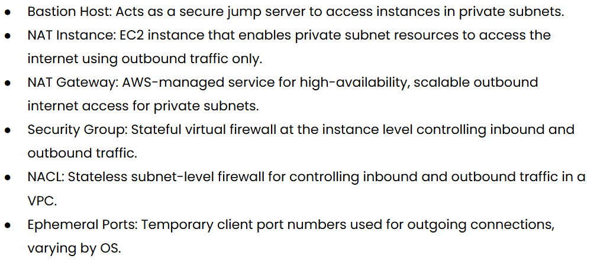
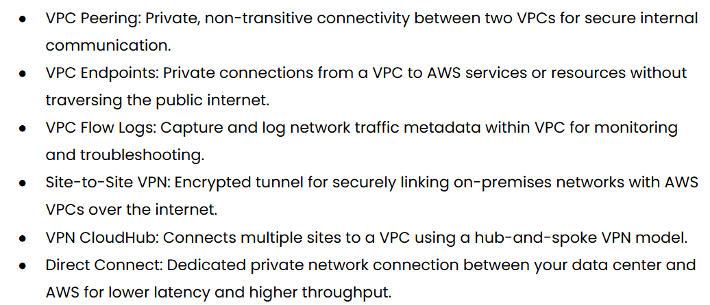
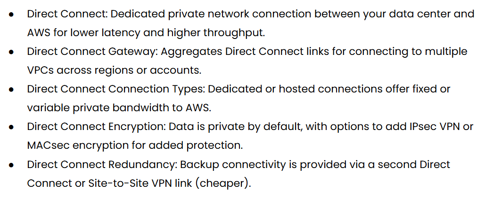

## **Day 24 of Learning AWS (Devops  Engineer)**

Today, I learned important AWS networking and connectivity concepts used for secure communication, internet access, and traffic control inside a VPC.

* Bastion Host is used as a secure jump server to access EC2 instances inside private subnets safely.
* NAT Instance allows private subnet resources to access the internet only for outbound traffic using an EC2 instance.
* NAT Gateway is an AWS-managed and highly available service that provides scalable outbound internet access for private subnets.
* Security Group works as a stateful firewall at the instance level to control inbound and outbound traffic.
* NACL (Network ACL) is a stateless firewall at the subnet level used for controlling VPC traffic.
* Ephemeral Port are temporary ports used by clients for outgoing network connections.

I also learned advanced VPC connectivity concepts:

* VPC Peering provides private communication between two VPCs.
* VPC Endpoints allow private access to AWS services without using the public internet.
* VPC Flow Logs help monitor and troubleshoot network traffic inside a VPC.
* Site-to-Site VPN creates an encrypted tunnel between on-premises networks and AWS.
* VPN CloudHub connects multiple branch offices using a hub-and-spoke VPN architecture.
* Direct Connect provides a dedicated private connection between AWS and a data center for better performance and lower latency.

Additionally, I learned:

* Direct Connect Gateway helps connect multiple VPCs across regions or accounts using a single Direct Connect.
* Direct Connect supports dedicated and hosted connection types based on bandwidth requirements.
* Direct Connect Encryption can be enhanced using IPsec VPN or MACsec for additional security.
* Direct Connect Redundancy improves reliability using backup Direct Connect links or Site-to-Site VPN connections.

